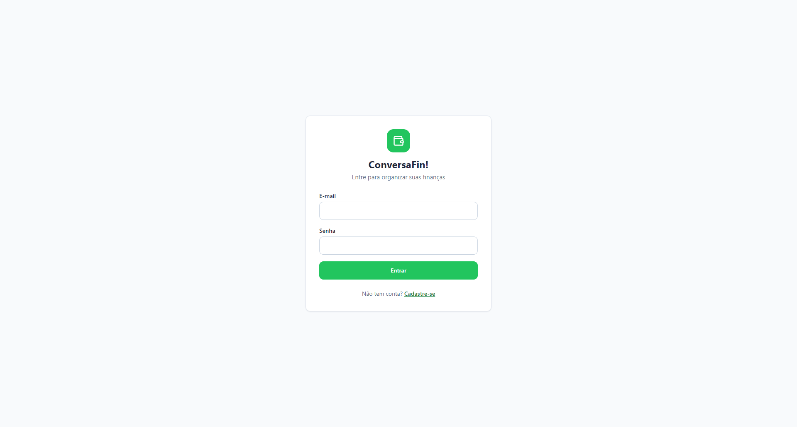
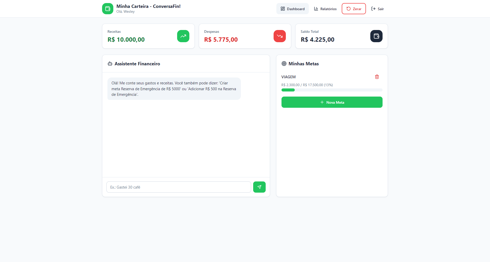
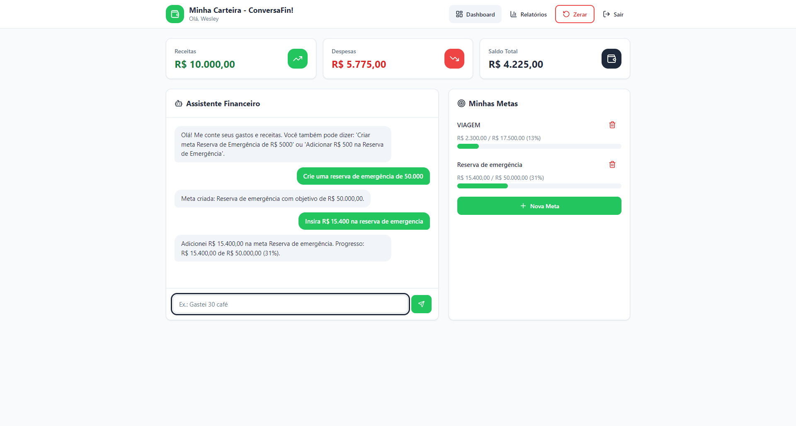
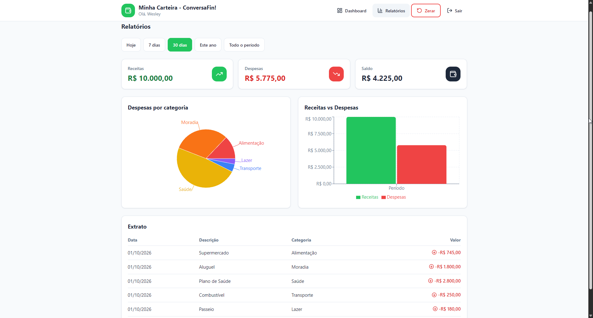

# ConversaFin - App de Organizacao de Financas Pessoais

### App Finanças: https://conversa-fin-buddy.lovable.app/login

## Prompt Final (PRD)

O PRD abaixo foi o prompt principal utilizado com a IA (Lovable) para gerar o conceito e as telas do aplicativo.

```text
# PRD - App para Organizacao de Financas Pessoais ConversaFin!

## 1. Contexto e Visao Geral
O produto e um aplicativo de organizacao de financas pessoais focado em simplicidade, operado por meio de conversas em linguagem natural. Ele elimina a necessidade de formularios manuais extensos ou planilhas complexas. O objetivo e tornar a gestao financeira acessivel, simples e engajadora para todos os usuarios.

## 2. Problema
- Aplicativos tradicionais exigem entrada manual excessiva e burocratica.
- Falta de personalizacao e experiencia engessada.
- Usuarios iniciantes desistem rapidamente do controle financeiro por conta da complexidade.

## 3. Publico-Alvo
- Pessoas que desejam comecar a organizar suas financas de forma pratica e sem complicacao.
- Principalmente iniciantes que buscam simplicidade, orientacao visual e pouca burocracia.

## 4. Funcionalidades-Chave (Escopo do MVP)

### 0. Autenticacao de Usuario
- Tela de login e cadastro com e-mail e senha.
- Cada usuario possui seus proprios dados financeiros.
- Sessao persistente e opcao de logout no header.
- Dados isolados por usuario, garantindo privacidade.

### 1. Registro via Chat
- Insercao de gastos e receitas em linguagem natural por texto (exemplo: "Gastei R$ 50 no mercado", "Recebi meu salario de R$ 3000").
- Interpretacao dinamica dos valores e intencao do usuario.

### 2. Classificacao e Criacao Automatica de Categorias
- Identificacao e categorizacao automatica das transacoes sem esforco manual.
- Logica de Autocadastro: caso a categoria nao exista, o app cria automaticamente e vincula a transacao.

### 3. Metas Financeiras
- Criacao e acompanhamento visual de objetivos de economia (exemplo: "Economizar R$ 500 para emergencia").
- Indicadores de progresso simples e diretos.

### 4. Agente Financeiro
- Recomendacoes personalizadas e dicas automaticas de economia enviadas no proprio fluxo de conversa com base nos gastos registrados.

### 5. Relatorios Simples
- Visualizacoes acessiveis e personalizadas (cards de resumo de receitas, despesas e saldo, alem de relatorios visuais simplificados).

### 6. Design Universal
- Interface projetada para oferecer uma otima experiencia para o maximo de usuarios possivel, independentemente de idade, nivel de habilidade digital ou necessidades especificas.
- Elementos com alto contraste, fontes legiveis, botoes amplos e suporte a navegacao intuitiva.

## 5. Diretrizes de Design, Layout e Paleta de Cores

### Paleta de Cores
- Cor Primaria: Verde Esmeralda (#22C55E).
- Fundo Geral: Cinza Claro Neutro (#F8FAFC).
- Cards: Branco (#FFFFFF) com bordas suaves em cinza (#E2E8F0).
- Receita: Verde (#22C55E).
- Despesa: Vermelho (#EF4444).
- Texto Principal: Grafite (#1E293B).

### Estrutura Visual
1. Tela de Login: formulario com e-mail e senha, botao de entrar e link para cadastro.
2. Dashboard Integrado: header com titulo e saudacao, 3 cards de resumo, chat e painel de metas.
3. Tela de Relatorios: cards filtrados por periodo, graficos e extrato.

## 6. Entregavel da IA (Estrutura do MVP)

### Telas e Componentes
- Tela de Autenticacao (Login e Cadastro).
- Chat de Interacao Conversacional.
- Dashboard Misto (Cards de Metricas + Painel de Metas).
- Tela de Relatorios Visuais Simplificados.

### Recursos Tecnicos
- Autenticacao de usuarios com e-mail e senha.
- Persistencia de dados por usuario.
- Processamento de Linguagem Natural (NLP).
- Motor de categorizacao automatica com adicao dinamica de categorias.
- Acessibilidade e usabilidade universal (WCAG 2.1 AA).

## 7. Plano de Validacao Inicial
- Testes com grupo piloto focado em usuarios iniciantes e perfis variados.
- Coleta de feedback sobre a clareza da conversa, utilidade das recomendacoes e acessibilidade do layout.
```

## Imagens das Interacoes com a IA

### Tela de Login



Tela inicial onde o usuario faz login ou cria uma conta com e-mail e senha.

### Dashboard Principal



Apos o login, o usuario visualiza seus cards de resumo, o chat do Assistente Financeiro e o painel de metas.

### Interacao no Chat com a IA



Usuario registra gastos e receitas via linguagem natural. A IA interpreta, categoriza e responde com dicas de economia personalizadas.

### Tela de Relatorios



Cards de resumo filtrados por periodo, grafico de despesas por categoria, comparacao entre receitas e despesas e extrato de transacoes.

## Resumo do Conceito do App

O ConversaFin e um aplicativo de organizacao de financas pessoais focado em simplicidade. Em vez de formularios manuais ou planilhas complexas, o usuario interage com o sistema por meio de conversas em linguagem natural.

O aplicativo possui autenticacao de usuario, garantindo que cada pessoa tenha seus proprios dados financeiros isolados. Apos o login, o usuario pode registrar gastos e receitas por chat, criar metas financeiras, receber dicas automaticas de economia e visualizar relatorios simples com filtros por periodo.

O design foi pensado para ser universal: alto contraste, fontes legiveis, botoes amplos e navegacao intuitiva, garantindo boa experiencia para o maior numero possivel de usuarios.

## Reflexao sobre o Processo

### O que funcionou bem?

- O PRD detalhado, usado como primeiro prompt no Lovable, gerou uma estrutura de interface proxima do resultado esperado, com dashboard, chat e painel de metas.
- A descricao clara das cores, do layout e das funcionalidades no PRD reduziu a necessidade de correcoes posteriores.
- O uso do Design Universal como requisito desde o inicio garantiu uma interface consistente e acessivel.
- A integracao nativa do Lovable com o Supabase facilitou a implementacao da autenticacao e do banco de dados.

### O que nao funcionou como o esperado?

- O primeiro prompt nao cobriu todos os detalhes das funcionalidades. Foi necessario iterar com prompts adicionais.
- A compreensao de frases informais, sem valores explicitos em reais, exigiu refinamento das instrucoes dadas a IA.
- Algumas funcionalidades, como a exclusao de metas, o botao de zerar dados e a persistencia do historico do chat, precisaram ser solicitadas separadamente.
- Ajustes finos na autenticacao (redirecionamento e persistencia de sessao) exigiram prompts especificos.

### O que aprendi sobre conversar com IAs?

- Contexto e fundamental. Um prompt de sistema claro, com regras e exemplos, e mais eficaz do que varios comandos soltos.
- A iteracao e parte natural do processo. O primeiro prompt raramente gera o resultado final; testar e refinar e essencial.
- Exemplos concretos de entrada e saida ajudam a IA a entender o comportamento esperado melhor do que descricoes abstratas.
- Definir limites para a IA (o que ela nao deve fazer) evita respostas incorretas ou inventadas.
- O Vibe Coding, na pratica, e uma habilidade de conversa. Quanto melhor a descricao, mais proximo o resultado.
